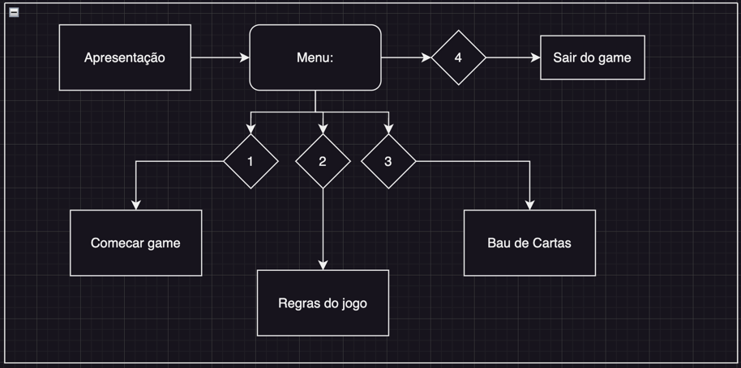
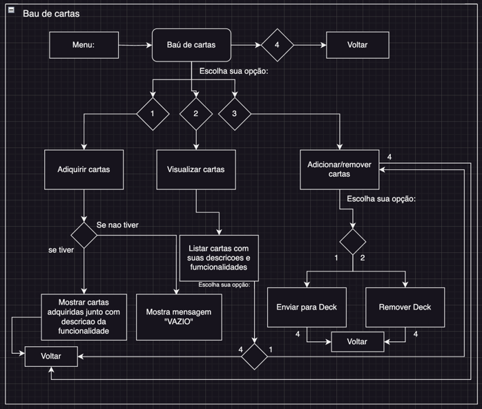
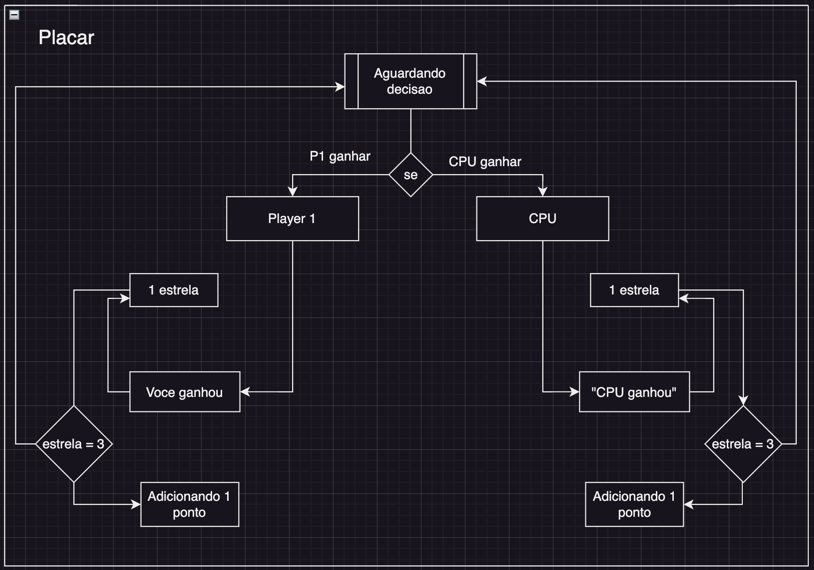

EM CONSTRUCAO [ fazendo a engenharia do software completa ]

## Criacao de um joguinho RPG  ##
Game de cartas simples apenas para estudo e pratica

** Criacao de menu:**

**Criacao de player-1 :**
Criacao de interacao com o teclado, dando possibilidade do jogador interagir de forma cognitiva em atuacao com as
escolhas do game, tornando modificavel para ao longo do jogo!

**CRIAÇÃO DE BAÚ DE CARTAS **

Baú de cartas => Criação do baú de cartas dá possibilidade de visualizar cartas as que já tem no Deck ou as que adiquiriu
na batalha, dando possibilidade de adicionar novas ou remover antigas, junto com sua descricao quando selecionado 
 
 **Criacao de Cpu:**
Quando player1 escolher uma opcao, a maquina automaticamente, escolhera a melhor opcao contra o opnonente player1

**Criacao de campos gerado pela CPU:**
É gerado um campo automatico contendo seu proprio elemento, dando assim a oportunidade de aumentar o nivel das
cartas, gerando novos niveis de cartas e funcionalidades.

**Placar de pontos:**

Aguardando decisao, quando um player ganhar o placar de estrelas aumenta +1 , chegando à 3, adicionar +1 ao 
placar para quem completar 3 estrelas

##  Mudanças:  ##

